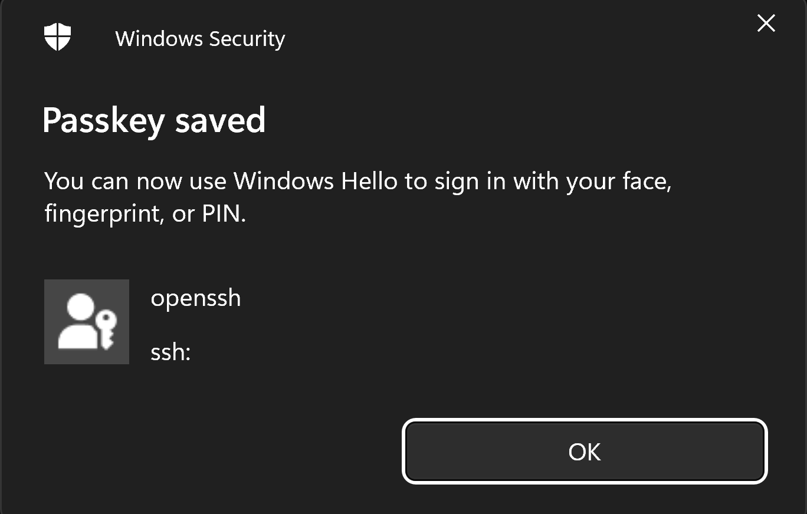
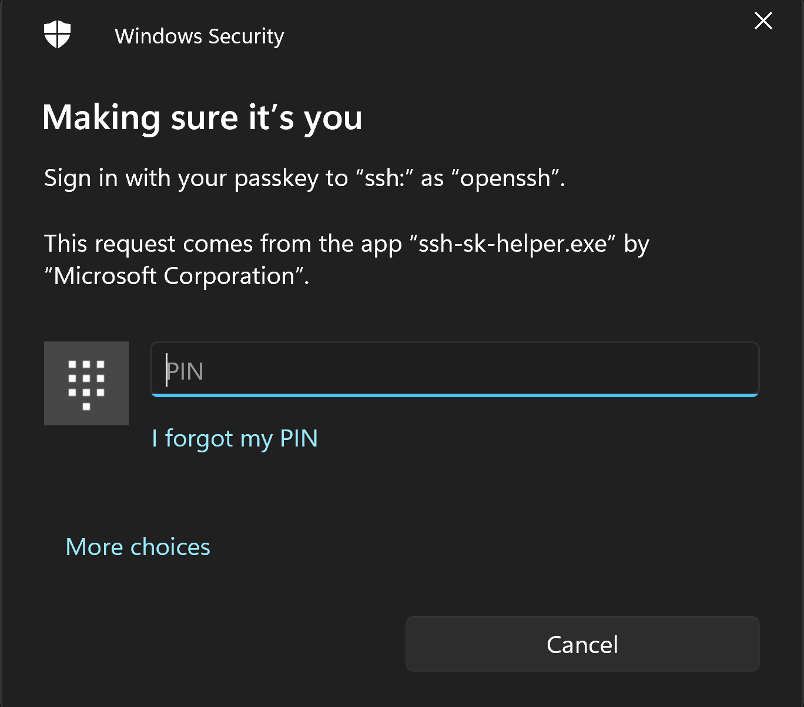

Here's how to use Passkeys to authenticate SSH connections.

<!--more-->

[Passkeys](https://fidoalliance.org/passkeys/) provide secure user authentication, using asynchronous key exchange.  When combined with device-hosted services like `Windows Hello`, users can confirm their identity using face ID, fingerprint or PIN. Created by the [FIDO Alliance](https://fidoalliance.org/), they say:

> Based on FIDO standards, passkeys are a replacement for passwords that provide faster, easier, and more secure sign-ins to websites and apps across a user’s devices. Unlike passwords, passkeys are always strong and phishing-resistant.​

Passkeys can be used to log in to apps on the web, also apps installed locally on a device, including SSH.

SSH is a core element of the [OpenSSH](https://www.openssh.com/) project.  Several Unix-like operating systems are supported. Microsoft Windows is also fully supported. Newer versions of OpenSSH support FIDO based authentication, such as Passkeys.

> TL;DR
> 1. Open a PowerShell terminal.
> 1. Install the latest version of [OpenSSH for Windows](https://github.com/PowerShell/Win32-OpenSSH/wiki/Install-Win32-OpenSSH-Using-MSI), with `winget install Microsoft.OpenSSH.Beta`.
> 1. Close and re-open PowerShell, then generate a new SSH key pair, with: `ssh-keygen -t ecdsa-sk`.
> 1. Copy the new public key (.pub file) to the remote server, with: `cat ~/.ssh/id_ecdsa_sk.pub | ssh alice@example.com 'mkdir -p ~/.ssh && cat >> ~/.ssh/authorized_keys'`  (change alice@example.com to your user/server).
> 1. SSH to the server, for example with: `ssh alice@example.com` (change alice@example.com to your user/server).

## Install The Latest Beta Version of OpenSSH for Windows

SSH is included in Windows as a `Windows Optional Feature`, see the [Microsoft Docs](https://docs.microsoft.com/en-us/windows-server/administration/openssh/openssh_install_firstuse) page for more information.  As such it is updated as part of Windows Feature Updates. 

Find the version currently installed:

```PowerShell
ssh -V
```

At the time of writing, this returns: "OpenSSH_for_Windows_8.6p1, LibreSSL 3.4.3".  This version does not support Passkeys or FIDO2 hardware security keys, such as YubiKeys. A newer version of OpenSSH must be installed.  This will be pushed out by Microsoft as part of a Windows Feature Update, but you can install the latest beta version..

To install the latest version available to the public, the latest *beta* version:

```PowerShell
winget install Microsoft.OpenSSH.Beta
```

Then exit PowerShell and re-open it. The SSH version should now have changed:

```PowerShell
ssh -V
```

At the time of writing, this is now: "OpenSSH_for_Windows_9.5p1, LibreSSL 3.8.2", which supports Passkeys.

### Create An SSH Key Pair

Use the [ssh-keygen](https://man.openbsd.org/ssh-keygen.1) command to create a public/private key pair. 

The type of key used in this example is "ecdsa-sk". 

A simple example would be:

```PowerShell
ssh-keygen -t ecdsa-sk
```

You might want to add to this and use the following optional parameters, to make it easier to identify the key pair later on:

- use `-O` to specify the application (SSH) and remote server name (in this example, "server21"), *example:* `-O application=ssh:server21`
- use `-C` to specify a comment, *example:* `-C "Host:ThinkPadX1"`

For example:

```PowerShell
ssh-keygen -t ecdsa-sk -O application=ssh:server21 -C "Host:ThinkPadX1"
```

Follow the on-screen instructions. As you are using a hardware security key, you will see a number of prompts generated by Windows Secuirty, guiding you through the process.


Confirmation that the passkey was saved is shown in the dialog box.



- follow the instructions in the terminal window
- enter a specific name for the key pair you are creating, or accept the default values
- optional, enter a passphrase for the key pair you are creating, or leave blank

The `ssh-keygen` command will generate a public/private key pair.  The public key will be stored in the `.ssh/id_ecdsa.pub` file, and the private key will be stored in the `.ssh/id_ecdsa` file.

To view the public key, use one of these commands:

This Linux command will be accepted by PowerShell as well as Linux:

```Bash
cat ~/.ssh/id_ecdsa_sk.pub
```

or

```PowerShell
Get-Content $env:USERPROFILE\.ssh\id_ecdsa_sk.pub
```

or, in a CMD prompt:

```Batchfile
type $env:USERPROFILE\.ssh\id_ecdsa_sk.pub
```

### Copy The Public Key To The Remote Server

The public key you just created, ~/.ssh/id_ecdsa_sk.pub, must be copied to the remote server. The current version of OpenSSH for Windows does not support the `ssh-copy-id` command. To copy the .pub key to the remote server, use:

> Note, before using one of the examples below, replace `same@server21` to the actual user and remote server you are using, *for example* `betty@108.23.54.237`.

This Linux command will be accepted by both Linux and PowerShell:

```Bash
cat ~/.ssh/id_ecdsa_sk.pub | ssh sam@server21 'mkdir -p ~/.ssh && cat >> ~/.ssh/authorized_keys'
```

or

```PowerShell
Get-Content $env:USERPROFILE\.ssh\id_ecdsa_sk.pub | ssh sam@server21 'mkdir -p ~/.ssh && cat >> ~/.ssh/authorized_keys'
```

or, in a CMD prompt:

```Batchfile
type $env:USERPROFILE\.ssh\id_ecdsa_sk.pub | ssh sam@server21 'mkdir -p ~/.ssh && cat >> ~/.ssh/authorized_keys'
```

### Test The Connection

Now you can SSH to the remote server, and you should be able to use Passkey to authenticate.

```PowerShell
ssh sam@server21
```

Confirm it is you:

